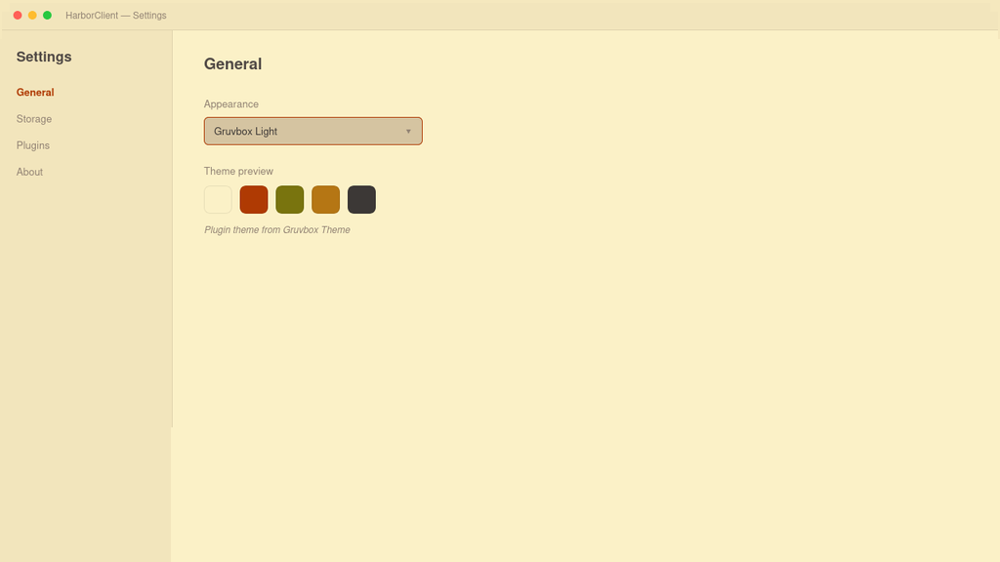

# Gruvbox Theme

Adds **Gruvbox Light** to Settings → General → Appearance.




## Permissions

- `ui` — theme registration

## Usage

Enable the plugin, then choose **Gruvbox Light** from the Appearance dropdown.

## Development

1. Run `pnpm install`
2. Run `pnpm build` (or `pnpm dev` for watch mode)
3. In HarborClient, open **Settings → Plugins → Load unpacked…** and select this project folder
4. Enable the plugin and select **Gruvbox Light** under **Settings → General → Appearance**

## Packaging

```bash
pnpm pack
```

This builds the renderer bundle and creates `../gruvbox.hcp` with `manifest.json`, `README.md`, `assets`, and `dist`.
